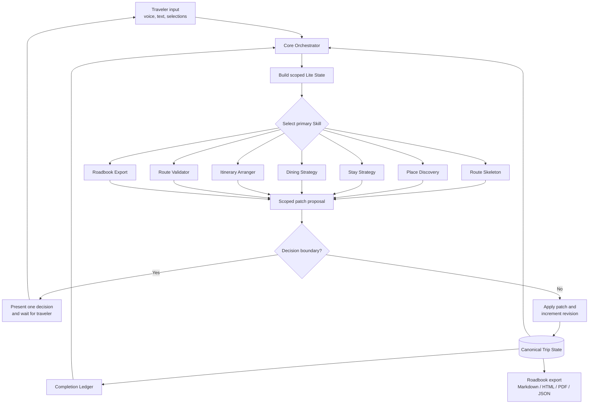
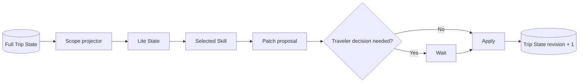

# Architecture

## System view



## Why an Orchestrator

The Orchestrator keeps the product from becoming one giant Prompt that must be reread on every turn. It decides which Skill owns the current output, passes only relevant state and combines supporting checks into one traveler-facing interaction.

## State model



The full Trip State is durable. Lite State is disposable and must not become a second source of truth. Runtime conversation state is stored separately.

## Ownership and handoffs

```text
Route Skeleton
  └─ confirmed corridor and allocation
       ├─ Place Discovery → selected experience IDs
       ├─ Stay Strategy → lodging anchors
       ├─ Dining Strategy → meal anchors
       └─ Itinerary Arranger → proposed days and route legs
                              └─ Route Validator → issues/evidence
                                                     └─ traveler decision
```

The handoff is state-based rather than transcript-based. Skills exchange IDs, scoped fields and patches instead of passing entire conversations.

## Evidence model

Time-sensitive facts can be:

- `not_checked`
- `unverified`
- `partially_verified`
- `verified`
- `source_conflict`

A map link is a navigation affordance, not proof that a timetable or opening time is correct. Precise services require a live or source-backed capability.

## Confirmation boundary

The Agent can apply non-destructive annotations and calculations. It must wait before changing traveler-owned route structure, personal-priority items, lodging, reservations or accepted risk.

This boundary is both a UX rule and a state rule: a pending decision contains proposed operations, while the canonical state remains unchanged until confirmation.
